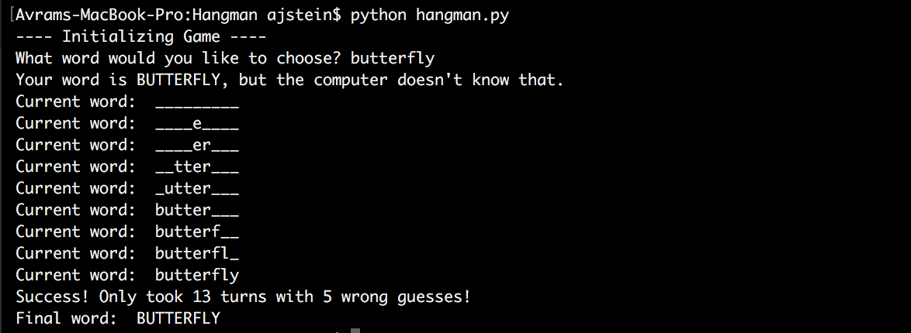
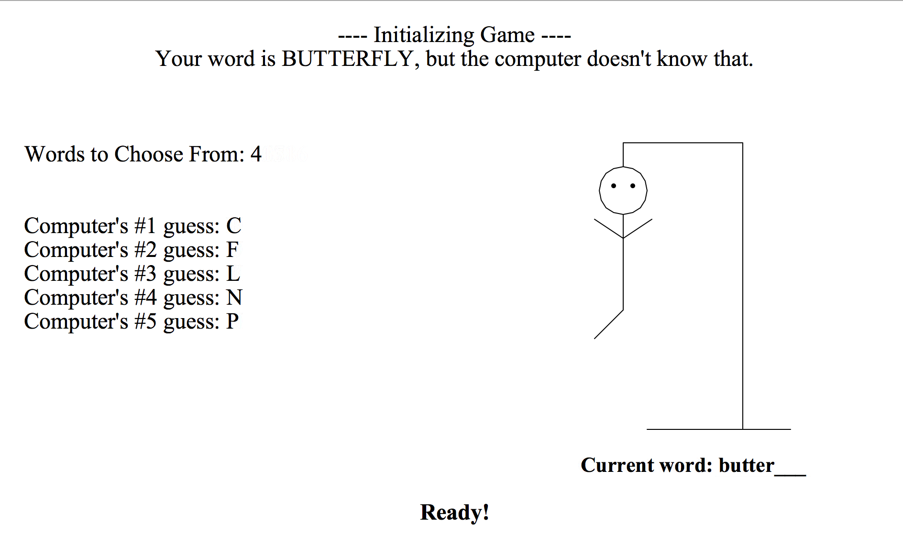

# Hangman
**Building and solving the game Hangman.**

### Solving Hangman

The game of Hangman is pretty simple: just guess letters and figure out the word before you lose. I had an idea as I woke up one morning of a way to have a computer solve the game of Hangman. I decided to implement it, and then possibly build the game around it.

I must have been reading about filtering dataframes as I was drifting off to sleep, because the basis of solving this problem is to incrementally add filters based on frequency analysis.

When a word is presented, the player (in this case, the computer) knows the length of the word. Already, we can eliminate the vast majority of words in the dictionary. From here, I expanded each letter into a separate column, so we have a word on each row, and a letter in each column, like such:

| Letter 1  | Letter 2  | Letter 3  | Letter 4  | Letter 5  | Letter 6  |
| :------------- | :------------- |:------------- | :------------- |:------------- | :------------- |
| K       | I       | T       | T       | E       | N       |
| T       | U       | R       | T       | L       | E       |
| D       | O       | N       | K       | E       | Y       |
| J       | A       | G       | U       | A       | R       |

The computer then finds the frequency of each letter in the entire dataframe. This provides a ranking of the most common to the least common letters, and gives the computer its options. The computer guesses the most common letter, since a correct letter in any location is good.

If the letter does NOT appear in the word, the computer eliminates all words containing the guessed letter from the dataframe. It calculates the frequency of each letter again, and then guesses again. For the example above, if the computer guesses 'K' (not the most common letter), but the word is 'JAGUAR', the computer would eliminate 'KITTEN' and 'DONKEY' and recalculate the most common letters.

If the letter DOES appear in the word, the computer fills it into all of its positions, and then eliminates all words from the data frame that don't have the guessed letter in those positions. For the example above, if the computer guesses 'A' (also not the most common letter), and the word is 'JAGUAR', the computer would fill in the two 'A's as the second and fifth letters and eliminate 'KITTEN', 'TURTLE', and 'DONKEY'.

Having tested this approach on hundreds of words in a sample, the success rate (of guessing within 9 turns) is about 95%.

Disclaimer: the dictionary I use is the one hidden deep within Unix computers. It's not a great dictionary by any stretch of the imagination, but is decent to practice on.

### Playing Hangman

Having a user play the game of hangman turned out to be a little more difficult than I expected. I was able to quickly build a version where I could just run from the command line. It requested a word from the user, checked to see if the word was in the dictionary, and requested a new one if it wasn't. From there, the computer would print out the updates of the game as it solved it with no other user interaction.

The next step was to build a graphic user interface, but after some experimenting, I found even TKinter to be a little outside my skill set right now. I went with a more intuitive module of TKinter called Turtle. It's a little less sophisticated, but much faster with which to express ideas. I decided to use Turtle for this project and potentially use a different project to learn more object-oriented programming.

The hangman script runs the game in advance, having the algorithm calculate moves and execute them, writing them out to a log as it goes. The turtle script reads through the log with a few regular expressions, and issues commands to Turtle as different events occur.

Once the turtle script was reading data smoothly and graphing things in the right places, the next improvement for the interface was an interactive element. The script executes one turn at a time, and waits for an on-screen click to continue. It displays the top options for the computer, the current word, the hangman, and how many words are in the dataframe the computer is drawing from.

**Note:** To run this game, you just need `fullgame.py` and `master_dict.txt`.

<!-- bottom -->
